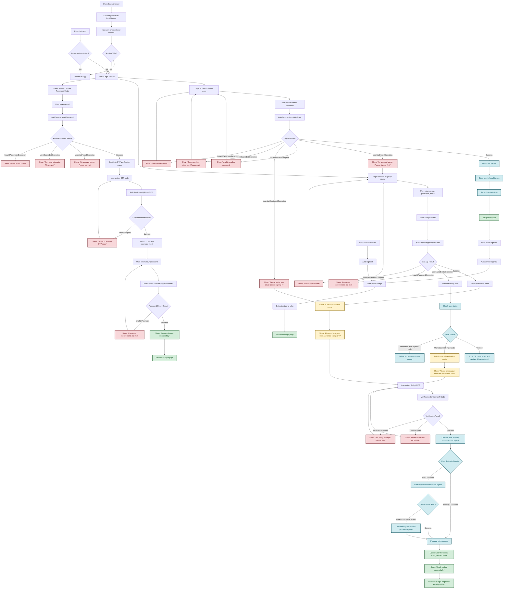

# Authentication Flow Diagram

## 🔐 Complete Sign-In & Sign-Out Flow

## 📋 Detailed Flow Descriptions

### **1. Initial Access Flow**

- **Entry Point**: User visits the application
- **Authentication Check**: App checks localStorage for existing session
- **Decision**: If authenticated → redirect to `/app`, else → show login screen

### **2. Sign In Flow**

**Primary Path:**

1. User enters email & password
2. `AuthService.signInWithEmail()` called
3. **Success**: Load profile → Store session → Navigate to `/app`
4. **Failure**: Show specific error message based on exception type

**Error Alternatives:**

- `UserNotFoundException`: "No account found. Please sign up first."
- `NotAuthorizedException`: "Invalid email or password"
- `UserNotConfirmedException`: "Please verify your email before signing in"
- `LimitExceededException`: "Too many login attempts. Please wait"
- `InvalidParameterException`: "Invalid email format"

### **3. Sign Up Flow**

**Primary Path:**

1. User enters email, password, name
2. User accepts terms and conditions
3. `AuthService.signUpWithEmail()` called
4. **Success**: Send verification email → Switch to verification mode
5. **Failure**: Handle specific exceptions

**UsernameExistsException Handling:**

1. Check user verification status in Cognito
2. **If Verified**: "Account exists and verified. Please sign in"
3. **If Unverified with valid code**: Switch to verification mode
4. **If Unverified with expired code**: Delete old account → Retry signup

### **4. Email Verification Flow**

**Primary Path:**

1. User enters 6-digit OTP code
2. `VerificationService.verifyCode()` called
3. **Success**: Check if user already confirmed in Cognito
4. **If not confirmed**: `AuthService.confirmUserInCognito()`
5. Update user metadata → Show success → Redirect to login

**Error Alternatives:**

- Invalid/Expired OTP: "Invalid or expired OTP code"
- Too many attempts: "Too many attempts. Please wait"
- Already confirmed: Proceed with success (no error)

### **5. Forgot Password Flow**

**Primary Path:**

1. User enters email address
2. `AuthService.resetPassword()` called
3. **Success**: Send reset OTP → Switch to OTP verification
4. User enters OTP code
5. `AuthService.verifyResetOTP()` called
6. **Success**: Switch to set new password mode
7. User enters new password
8. `AuthService.confirmForgotPassword()` called
9. **Success**: Show success message → Redirect to login

**Error Alternatives:**

- User not found: "No account found. Please sign up"
- Too many attempts: "Too many attempts. Please wait"
- Invalid email: "Invalid email format"
- Invalid OTP: "Invalid or expired OTP code"
- Invalid password: "Password requirements not met"

### **6. Sign Out Flow**

**Primary Path:**

1. User clicks sign out button
2. `AuthService.signOut()` called
3. Clear localStorage (user, session)
4. Set auth state to false
5. Redirect to login page

**Alternative Paths:**

- **Session Expiry**: Auto sign out when session expires
- **Browser Close**: Session persists in localStorage for next visit
- **Session Check**: On next visit, validate stored session

## 🔄 Recovery & Error Handling

### **Session Recovery**

- Stored session checked on app initialization
- Valid session → Auto-login
- Invalid session → Clear storage → Show login

### **Error Recovery**

- All error states provide clear user guidance
- Error messages include actionable next steps
- Users can easily switch between sign-in/sign-up modes

### **Security Measures**

- Password requirements enforced
- Rate limiting on login attempts
- Session timeout handling
- Secure token storage in localStorage

## 🎯 Key Success Criteria

✅ **User Experience:**

- Clear error messages with actionable guidance
- Smooth transitions between authentication modes
- Consistent UI across all authentication screens
- No "scary" error messages

✅ **Security:**

- Proper validation of all inputs
- Secure handling of authentication tokens
- Protection against common attack vectors
- Rate limiting on sensitive operations

✅ **Reliability:**

- Graceful handling of network errors
- Fallback mechanisms for failed operations
- Consistent state management
- Proper cleanup on sign out
